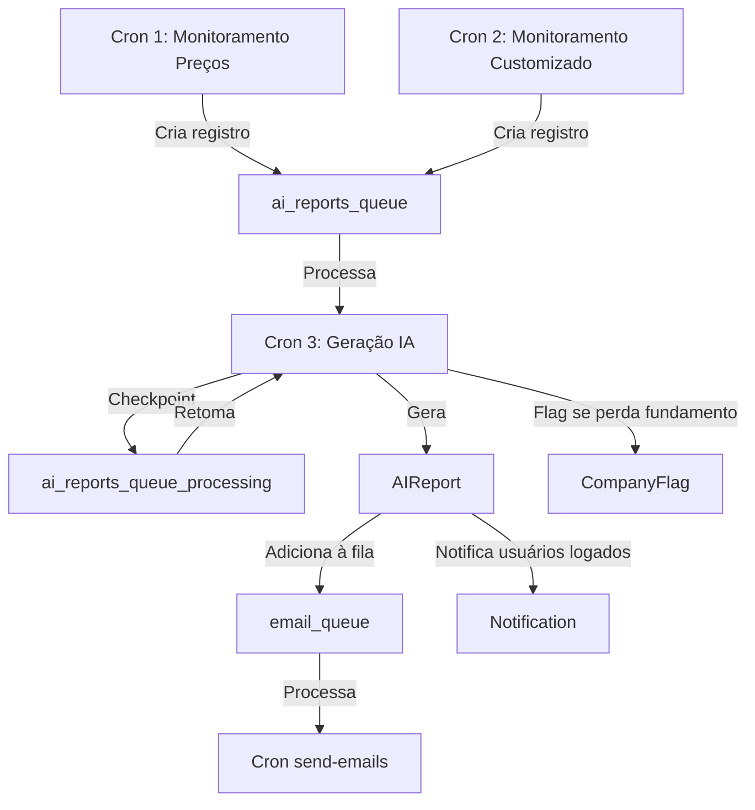

# Expansão do Sistema de Relatórios de IA

## Visão Geral

Expandir o sistema atual de relatórios de IA (`MONTHLY_OVERVIEW` e `FUNDAMENTAL_CHANGE`) para incluir duas novas modalidades:

1. **Relatório de Variação de Preço**: Gatilhos automáticos baseados em quedas de preço
2. **Relatório Customizado**: Gatilhos configurados pelo usuário

## Arquitetura

### Fluxo de Dados

## 1. Schema do Banco de Dados

### Novas Tabelas no `schema.prisma`

#### `ai_reports_queue`

Fila de relatórios pendentes de geração:

- `id`, `companyId`, `reportType` (PRICE_VARIATION | CUSTOM_TRIGGER)
- `triggerReason` (JSON com detalhes do gatilho)
- `status` (PENDING | PROCESSING | COMPLETED | FAILED)
- `priority`, `createdAt`, `processedAt`

#### `ai_reports_queue_processing`

Checkpointing para processamento fragmentado:

- `queueId` (FK para ai_reports_queue)
- `step` (RESEARCH | ANALYSIS | COMPILATION)
- `stepData` (JSON com output de cada etapa)
- `completedAt`

#### `user_asset_monitor`

Gatilhos customizados do usuário:

- `id`, `userId`, `companyId`
- `triggerConfig` (JSON com filtros: P/L, P/VP, Score, Preço)
- `isActive`, `createdAt`, `lastTriggeredAt`

#### `CompanyFlag`

Flags de perda de fundamento:

- `id`, `companyId`, `reportId` (FK para AIReport)
- `flagType` (FUNDAMENTAL_LOSS)
- `reason` (texto explicativo)
- `isActive`, `createdAt`

### Atualizações no Enum `AIReportType`

Adicionar: `PRICE_VARIATION`, `CUSTOM_TRIGGER`

## 2. Serviços e Lógica

### `price-variation-service.ts`

Serviço para detectar variações de preço:

- `checkPriceVariations(companyId)`: Verifica 3 janelas (1 dia, 30 dias, 365 dias)
- `calculatePriceChange(ticker, days)`: Calcula variação usando `quote-service.ts`
- `shouldTriggerReport(variation, threshold)`: Valida contra thresholds do env
- Usa `getYahooHistoricalPrice()` e `getLatestPrices()` do `quote-service.ts`

### `custom-trigger-service.ts`

Serviço para gatilhos customizados:

- `checkCustomTriggers()`: Itera sobre `user_asset_monitor` ativos
- `evaluateTrigger(monitor, companyData)`: Valida condições (P/L, P/VP, Score, Preço)
- `createQueueEntry(monitor, triggerReason)`: Cria entrada na fila

### `ai-report-queue-service.ts`

Serviço para gerenciar fila de processamento:

- `addToQueue(params)`: Adiciona relatório à fila
- `getNextBatch(limit)`: Busca próximos itens pendentes
- `markProcessing(queueId)`: Marca como PROCESSING
- `saveCheckpoint(queueId, step, data)`: Salva progresso
- `getCheckpoint(queueId)`: Retorna estado atual
- `completeQueue(queueId, reportId)`: Finaliza processamento

### `price-variation-report-service.ts`

Geração de relatório de variação de preço:

- `generatePriceVariationReport(params)`: Gera relatório completo
- `researchPriceDropReason(ticker, variation)`: Pesquisa na internet usando Gemini
- `analyzeFundamentalImpact(ticker, researchData)`: Analisa se é perda de fundamento
- `createFlagIfNeeded(companyId, reportId, reason)`: Cria flag se necessário
- Usa `callGeminiAPI()` com `googleSearch: {}` para pesquisa

### `custom-trigger-report-service.ts`

Geração de relatório customizado:

- `generateCustomTriggerReport(params)`: Compila dados do gatilho
- `explainTrigger(triggerConfig, companyData)`: Explica motivo do disparo
- `addEducationalContent(triggerType)`: Adiciona conteúdo educativo

## 3. Cron Jobs

### Cron 1: Monitoramento de Preços

**Arquivo**: `src/app/api/cron/monitor-price-variations/route.ts`

**Lógica**:

- Itera sobre `companies` ordenado por `lastCheckedAt` (NULL primeiro)
- Para cada empresa:
  - Busca preços usando `quote-service.ts` (1 dia, 30 dias, 365 dias)
  - Calcula variações percentuais
  - Compara com thresholds do env (`PRICE_DROP_1D`, `PRICE_DROP_30D`, `PRICE_DROP_1Y`)
  - Se threshold atingido, cria entrada em `ai_reports_queue`
- Atualiza `lastCheckedAt` após processamento
- Processa em lotes para evitar timeout

**Variáveis de Ambiente**:

- `PRICE_DROP_1D=5` (5%)
- `PRICE_DROP_30D=20` (20%)
- `PRICE_DROP_1Y=50` (50%)
- `PRICE_MONITORING_BATCH_SIZE=50`

### Cron 2: Monitoramento de Gatilhos Customizados

**Arquivo**: `src/app/api/cron/monitor-custom-triggers/route.ts`

**Lógica**:

- Busca todos os `user_asset_monitor` ativos
- Para cada monitoramento:
  - Busca dados da empresa (FinancialData, AssetSnapshot para Score)
  - Avalia condições do `triggerConfig`
  - Se condições atendidas e não foi disparado recentemente:
    - Cria entrada em `ai_reports_queue` com tipo `CUSTOM_TRIGGER`
    - Atualiza `lastTriggeredAt`
- Processa em lotes

**Variáveis de Ambiente**:

- `CUSTOM_TRIGGER_BATCH_SIZE=30`

### Cron 3: Geração de Relatório e Disparo

**Arquivo**: `src/app/api/cron/generate-ai-reports/route.ts`

**Lógica com Checkpointing**:

1. Busca próximo item de `ai_reports_queue` com status PENDING ou PROCESSING
2. Se PROCESSING, busca checkpoint em `ai_reports_queue_processing`
3. Processa em etapas:

   - **RESEARCH**: Pesquisa na internet (apenas para PRICE_VARIATION)
   - **ANALYSIS**: Interpretação e correlação dos dados
   - **COMPILATION**: Geração final do relatório

4. Salva checkpoint após cada etapa
5. Se timeout, retoma na próxima execução
6. Ao completar:

   - Cria `AIReport`
   - Cria flag se necessário (PRICE_VARIATION com perda de fundamento)
   - Busca subscribers (UserAssetSubscription) para a empresa
   - Para usuários logados: cria `Notification`
   - Para subscriptions anônimas: adiciona email à `email_queue` usando `EmailQueueService.queueEmail()`
   - Marca fila como COMPLETED

**Variáveis de Ambiente**:

- `AI_REPORT_GENERATION_BATCH_SIZE=5`
- `AI_REPORT_TIMEOUT_MS=50000` (50s para deixar margem)

## 4. Integração com Sistema Existente

### Atualizar `ai-reports-service.ts`

- Adicionar métodos para novos tipos de relatório
- Integrar com `ai-report-queue-service.ts`

### Atualizar `smart-query-cache.ts`

Adicionar mapeamentos para novas tabelas:

- `PRISMA_MODEL_TO_TABLE`: `aiReportsQueue`, `aiReportsQueueProcessing`, `userAssetMonitor`, `companyFlag`
- `TABLE_DEPENDENCIES`: Dependências de cache

### Atualizar `quote-service.ts` (se necessário)

Garantir que `getYahooHistoricalPrice()` suporta datas específicas corretamente

## 5. Endpoints e UI

### API Endpoints

- `POST /api/user-asset-monitor`: Criar gatilho customizado
- `GET /api/user-asset-monitor`: Listar gatilhos do usuário
- `DELETE /api/user-asset-monitor/:id`: Remover gatilho
- `GET /api/company-flags/:ticker`: Buscar flags de uma empresa

### Componentes Frontend (futuro)

- Formulário para criar gatilhos customizados
- Lista de gatilhos ativos
- Exibição de flags na página da empresa

## 6. Pontos Críticos

### Checkpointing

- Cada etapa deve ser idempotente
- Verificar checkpoint antes de iniciar cada etapa
- Salvar output completo de cada etapa no JSON

### Pesquisa na Internet

- Usar `googleSearch: {}` do Gemini
- Prompt estruturado para guiar pesquisa
- Timeout de 30s para pesquisa (deixar 20s para outras etapas)

### Flagging de Empresas

- Criar flag apenas quando conclusão for "Perda de Fundamento"
- Flag deve referenciar o relatório que gerou
- Considerar impacto no score geral (penalização)

### Performance

- Processar empresas em lotes pequenos
- Priorizar por data de atualização mais antiga
- Evitar processar mesma empresa múltiplas vezes

## 7. Arquivos a Criar/Modificar

### Criar

- `src/lib/price-variation-service.ts`
- `src/lib/custom-trigger-service.ts`
- `src/lib/ai-report-queue-service.ts`
- `src/lib/price-variation-report-service.ts`
- `src/lib/custom-trigger-report-service.ts`
- `src/app/api/cron/monitor-price-variations/route.ts`
- `src/app/api/cron/monitor-custom-triggers/route.ts`
- `src/app/api/cron/generate-ai-reports/route.ts`
- `src/app/api/user-asset-monitor/route.ts`
- `src/app/api/company-flags/[ticker]/route.ts`

### Modificar

- `prisma/schema.prisma` (novas tabelas e enums, atualizar enum EmailType)
- `src/lib/smart-query-cache.ts` (mapeamentos)
- `src/lib/ai-reports-service.ts` (integração com novos tipos)
- `src/lib/email-queue-service.ts` (adicionar casos para novos tipos de email e templates)
- `env.example` (novas variáveis de ambiente)

## 8. Migração e Deploy

1. Criar migration do Prisma para novas tabelas
2. Adicionar variáveis de ambiente
3. Configurar crons externos (cron-job.org ou similar)
4. Testar cada cron isoladamente
5. Monitorar logs e performance

## 9. Testes Recomendados

- Testar detecção de variações de preço com dados reais
- Testar checkpointing com timeout simulado
- Testar pesquisa na internet com diferentes cenários
- Testar criação de flags
- Testar gatilhos customizados com diferentes filtros