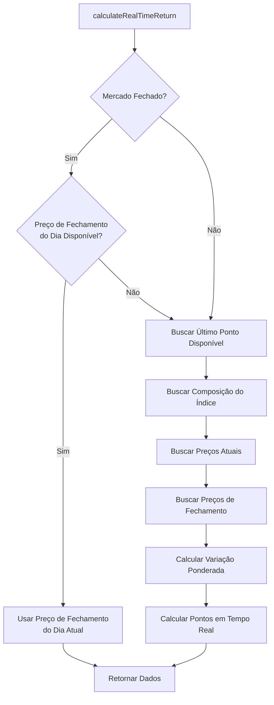

# Regras de Cache e Comportamento - Sistema de Índices

## 📋 Índice

1. [Horário do Mercado](#horário-do-mercado)
2. [Endpoints e Estratégias de Cache](#endpoints-e-estratégias-de-cache)
3. [Comportamento por Estado do Mercado](#comportamento-por-estado-do-mercado)
4. [Lógica de Preço de Fechamento](#lógica-de-preço-de-fechamento)
5. [Fluxo de Dados em Tempo Real](#fluxo-de-dados-em-tempo-real)
6. [Considerações Técnicas](#considerações-técnicas)

---

## 🕐 Horário do Mercado

### Mercado B3 (Brasil)

- **Horário de Funcionamento**: Segunda a Sexta-feira, das **10h às 18h** (horário de Brasília)
- **Fechado**: Fins de semana OU antes das 10h OU após 18h
- **Timezone**: `America/Sao_Paulo` (UTC-3)

### Funções de Verificação

```typescript
// Mercado aberto: Segunda a Sexta, 10h <= hora < 18h
isBrazilMarketOpen(): boolean

// Mercado fechado: Fim de semana OU hora < 10h OU hora >= 18h
isBrazilMarketClosed(): boolean
```

**Arquivos**:
- `src/lib/index-realtime-return.ts` - Função `isBrazilMarketOpen()`
- `src/app/api/market-indices/route.ts` - Função `isBrazilMarketClosed()`
- `src/app/api/indices/[ticker]/realtime-return/route.ts` - Função `isBrazilMarketClosed()`

---

## 🔄 Endpoints e Estratégias de Cache

### 1. `/api/market-indices` (Tarja de Índices)

**Arquivo**: `src/app/api/market-indices/route.ts`

**Propósito**: Retorna lista de índices internacionais e próprios para exibição na tarja superior.

#### Estratégia de Cache

| Estado do Mercado | Preço de Fechamento | Cache Redis | Cache-Control HTTP | Comportamento |
|-------------------|---------------------|-------------|-------------------|---------------|
| **Aberto** | N/A | ✅ 1 hora | `s-maxage=3600` | Usa cache normalmente |
| **Fechado** | ❌ Não disponível | ❌ Ignora cache | `s-maxage=60` | Busca dados frescos até preço estar disponível |
| **Fechado** | ✅ Disponível | ✅ 24 horas | `s-maxage=86400` | Cache até próximo pregão |

#### Lógica de Decisão

```typescript
if (marketClosed) {
  // Verifica se pelo menos um índice já tem preço de fechamento
  const hasAnyClosingPrice = await Promise.all(
    indicesList.slice(0, 3).map(index => hasTodayClosingPrice(index.id))
  );
  
  // Se nenhum índice tem preço ainda, ignorar cache
  shouldIgnoreCache = !hasAnyClosingPrice.some(Boolean);
}
```

#### Detalhes Técnicos

- **Cache Key**: `market-indices`
- **TTL quando aberto**: 3600 segundos (1 hora)
- **TTL quando fechado**: 86400 segundos (24 horas)
- **Verificação**: Amostra dos primeiros 3 índices para determinar disponibilidade

---

### 2. `/api/indices/[ticker]/realtime-return` (Rentabilidade em Tempo Real)

**Arquivo**: `src/app/api/indices/[ticker]/realtime-return/route.ts`

**Propósito**: Calcula e retorna rentabilidade em tempo real de um índice específico.

#### Estratégia de Cache

| Estado do Mercado | Preço de Fechamento | Cache Redis | Cache-Control HTTP | Comportamento |
|-------------------|---------------------|-------------|-------------------|---------------|
| **Aberto** | N/A | ✅ 1 minuto | `s-maxage=60` | Cache curto para dados em tempo real |
| **Fechado** | ❌ Não disponível | ❌ Ignora cache | `s-maxage=60` | Busca dados frescos até preço estar disponível |
| **Fechado** | ✅ Disponível | ✅ 24 horas | `s-maxage=86400` | Cache até próximo pregão |

#### Lógica de Decisão

```typescript
if (marketClosed) {
  const hasClosingPrice = await hasTodayClosingPrice(index.id);
  shouldIgnoreCache = !hasClosingPrice;
  
  if (shouldIgnoreCache) {
    console.log(`Mercado fechado mas preço ainda não disponível - ignorando cache`);
  }
}
```

#### Detalhes Técnicos

- **Cache Key**: `index-realtime-return-{indexId}`
- **TTL quando aberto**: 60 segundos (1 minuto)
- **TTL quando fechado**: 86400 segundos (24 horas)
- **Verificação**: Índice específico

---

### 3. `/api/indices` (Lista de Índices)

**Arquivo**: `src/app/api/indices/route.ts`

**Propósito**: Lista todos os índices com performance atual.

#### Estratégia de Cache

- **Revalidate**: 60 segundos (Next.js ISR)
- **Cache**: Gerenciado pelo Next.js
- **Comportamento**: Revalidação automática a cada 1 minuto

---

### 4. `/api/indices/[ticker]` (Detalhes do Índice)

**Arquivo**: `src/app/api/indices/[ticker]/route.ts`

**Propósito**: Retorna detalhes completos de um índice específico.

#### Estratégia de Cache

- **Revalidate**: Configurado pelo Next.js
- **Cache**: Gerenciado pelo Next.js ISR
- **Comportamento**: Cache padrão do Next.js

---

## 📊 Comportamento por Estado do Mercado

### Mercado Aberto (10h - 18h)

#### Comportamento Geral

1. **Cálculo em Tempo Real**: Todos os endpoints calculam variação usando preços atuais vs último fechamento oficial
2. **Cache Curto**: Cache de 1 minuto para dados em tempo real
3. **Atualização Contínua**: Dados são recalculados frequentemente

#### Exemplo de Cálculo

```typescript
// Busca último ponto oficial (dia anterior)
const lastOfficialPoints = 100.0;

// Calcula variação ponderada em tempo real
const totalReturn = Σ(weight_i × return_i);

// Pontos em tempo real
const realTimePoints = lastOfficialPoints × (1 + totalReturn);

// Variação diária (%)
const dailyChange = totalReturn × 100;
```

---

### Mercado Fechado (Antes das 10h, Após 18h, Fins de Semana)

#### Comportamento Geral

1. **Verificação de Preço de Fechamento**: Sistema verifica se preço de fechamento do dia já está disponível
2. **Dois Cenários Possíveis**:
   - **Preço disponível**: Usa preço de fechamento oficial do dia
   - **Preço não disponível**: Ignora cache e busca dados frescos até preço estar disponível

#### Cenário 1: Preço de Fechamento Disponível

```typescript
// Busca ponto de fechamento do dia atual
const todayPoint = await prisma.indexHistoryPoints.findFirst({
  where: { indexId, date: today },
});

if (todayPoint) {
  // Usa preço de fechamento oficial
  realTimePoints = todayPoint.points; // Ex: 103.0
  dailyChange = todayPoint.dailyChange; // Ex: 3.0%
  lastOfficialPoints = todayPoint.points; // 103.0 (não 100.0!)
  
  // Cache por 24 horas
  cache.set(key, data, { ttl: 86400 });
}
```

#### Cenário 2: Preço de Fechamento Não Disponível

```typescript
// Preço ainda não foi processado pelo CRON
// Ignora cache e busca dados frescos
shouldIgnoreCache = true;

// Usa último ponto disponível (dia anterior)
const lastPoint = await prisma.indexHistoryPoints.findFirst({
  orderBy: { date: 'desc' },
});

// Calcula variação em tempo real (se mercado fechou recentemente)
// ou usa último fechamento oficial
```

---

## 🔍 Lógica de Preço de Fechamento

### Função `hasTodayClosingPrice(indexId: string)`

**Arquivos**:
- `src/app/api/market-indices/route.ts`
- `src/app/api/indices/[ticker]/realtime-return/route.ts`

#### Implementação

```typescript
async function hasTodayClosingPrice(indexId: string): Promise<boolean> {
  const now = new Date();
  const formatter = new Intl.DateTimeFormat('en-US', {
    timeZone: 'America/Sao_Paulo',
    year: 'numeric',
    month: '2-digit',
    day: '2-digit',
  });
  
  const parts = formatter.formatToParts(now);
  const year = parseInt(parts.find(p => p.type === 'year')?.value || '0', 10);
  const month = parseInt(parts.find(p => p.type === 'month')?.value || '0', 10) - 1;
  const day = parseInt(parts.find(p => p.type === 'day')?.value || '0', 10);
  
  const today = new Date(Date.UTC(year, month, day, 0, 0, 0, 0));
  
  const todayPoint = await prisma.indexHistoryPoints.findFirst({
    where: {
      indexId,
      date: today,
    },
    select: { id: true },
  });
  
  return !!todayPoint;
}
```

#### Quando o Preço de Fechamento é Criado

- **Processamento**: CRON job executa após fechamento do mercado
- **Horário**: Geralmente após 18h (horário de Brasília)
- **Tabela**: `IndexHistoryPoints`
- **Campos**: `points`, `dailyChange`, `date`

---

## ⚡ Fluxo de Dados em Tempo Real

### Função `calculateRealTimeReturn(indexId: string)`

**Arquivo**: `src/lib/index-realtime-return.ts`

#### Fluxo Completo



#### Early Return (Otimização)

Quando mercado fechado e preço de fechamento disponível:

```typescript
if (marketClosed && lastHistoryPoint.date.getTime() === today.getTime()) {
  // Early return - não precisa calcular variação em tempo real
  return {
    realTimePoints: lastOfficialPoints,
    realTimeReturn: ((lastOfficialPoints - 100) / 100) * 100,
    dailyChange: todayPoint.dailyChange,
    lastOfficialPoints: lastOfficialPoints, // Preço de fechamento do dia!
    lastOfficialDate: lastOfficialDate,
    isMarketOpen: false,
  };
}
```

**Benefício**: Evita cálculos desnecessários quando já temos o resultado final.

---

## 🛠️ Considerações Técnicas

### 1. Timezone

- **Sempre usar**: `America/Sao_Paulo` para cálculos de data/hora
- **Motivo**: Garantir comparação correta entre datas do banco e horário atual

### 2. Cache Redis

- **Serviço**: `src/lib/cache-service.ts`
- **Uso**: Cache de dados calculados para reduzir carga no banco
- **TTL Dinâmico**: Baseado no estado do mercado

### 3. Cache HTTP (Next.js)

- **Headers**: `Cache-Control` configurado dinamicamente
- **stale-while-revalidate**: Permite servir cache enquanto revalida em background
- **Variação**: Baseada no estado do mercado

### 4. Performance

- **Early Returns**: Evita cálculos desnecessários quando possível
- **Queries Otimizadas**: Uso de índices no banco de dados
- **Batch Operations**: Múltiplas queries em paralelo quando possível

### 5. Logs e Debugging

- **Console Logs**: Incluem emoji 📊 para fácil identificação
- **Mensagens**: Descrevem claramente o comportamento do cache
- **Exemplo**: `📊 [API] Mercado fechado mas preço de fechamento ainda não disponível - ignorando cache`

---

## 📝 Resumo das Regras

### Regra 1: Horário do Mercado
- **Aberto**: Segunda a Sexta, 10h - 18h (Brasília)
- **Fechado**: Fora desse horário ou fins de semana

### Regra 2: Cache quando Mercado Aberto
- **Market Indices**: Cache de 1 hora
- **Realtime Return**: Cache de 1 minuto
- **Motivo**: Dados mudam frequentemente durante o pregão

### Regra 3: Cache quando Mercado Fechado SEM Preço
- **Comportamento**: Ignora cache completamente
- **Motivo**: Aguardar processamento do CRON que cria preço de fechamento
- **Cache-Control**: Curto (60s) para forçar revalidação frequente

### Regra 4: Cache quando Mercado Fechado COM Preço
- **Comportamento**: Cache por 24 horas
- **Motivo**: Preço de fechamento não muda até próximo pregão
- **Cache-Control**: Longo (86400s) para reduzir carga

### Regra 5: LastOfficialPoints
- **Quando mercado fechado E preço disponível**: Usa preço de fechamento do dia atual (ex: 103)
- **Quando mercado aberto OU fechado sem preço**: Usa último ponto disponível (ex: 100)

### Regra 6: Early Return
- **Quando**: Mercado fechado + preço de fechamento disponível
- **Ação**: Retorna imediatamente sem calcular variação em tempo real
- **Benefício**: Economiza processamento

---

## 🔄 Fluxo de Atualização Diário

### Durante o Pregão (10h - 18h)

1. Mercado aberto
2. Endpoints calculam variação em tempo real
3. Cache curto (1 minuto para realtime, 1 hora para market-indices)
4. Dados atualizados frequentemente

### Após Fechamento (18h+)

1. Mercado fecha às 18h
2. Sistema detecta mercado fechado
3. Verifica se preço de fechamento já está disponível
4. **Se não disponível**: Ignora cache, busca dados frescos
5. **Se disponível**: Usa preço de fechamento, cache por 24h

### Processamento do CRON (Após 18h)

1. CRON job executa após fechamento
2. Calcula pontos de fechamento do dia
3. Salva em `IndexHistoryPoints` com `date = hoje`
4. Próxima requisição detecta preço disponível
5. Sistema passa a usar cache de 24h

### Próximo Pregão (10h do dia seguinte)

1. Mercado abre às 10h
2. Sistema detecta mercado aberto
3. Volta a calcular variação em tempo real
4. Cache volta a ser curto (1 minuto)
5. Ciclo se repete

---

## 🐛 Troubleshooting

### Problema: `lastOfficialPoints` retornando valor do dia anterior

**Causa**: Mercado fechado mas preço de fechamento ainda não processado

**Solução**: Sistema está funcionando corretamente. Aguardar processamento do CRON.

### Problema: Cache não atualizando após fechamento

**Causa**: Preço de fechamento não disponível ainda

**Solução**: Sistema ignora cache intencionalmente. Verificar se CRON executou.

### Problema: Dados desatualizados durante pregão

**Causa**: Cache muito longo

**Solução**: Verificar se `Cache-Control` está configurado corretamente (60s para realtime).

---

## 📚 Referências

- **Arquivos Principais**:
  - `src/lib/index-realtime-return.ts` - Cálculo de rentabilidade
  - `src/app/api/market-indices/route.ts` - Endpoint de índices do mercado
  - `src/app/api/indices/[ticker]/realtime-return/route.ts` - Endpoint de realtime return
  - `src/lib/cache-service.ts` - Serviço de cache Redis

- **Documentação Relacionada**:
  - `INDICES.md` - Visão geral do sistema de índices
  - `INDICE_PLAN.md` - Plano de implementação
  - `docs/SMART_QUERY_CACHE.md` - Sistema de cache inteligente

---

**Última Atualização**: Dezembro 2024  
**Versão**: 1.0


